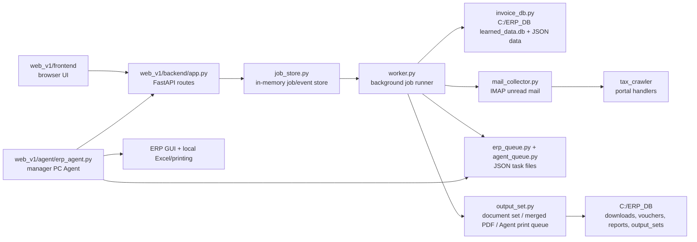

# CODEBASE WIKI

Updated: 2026-05-15

This wiki is based on the current `graphify-out/GRAPH_REPORT.md`, direct Graphify navigation against the active graph, and spot checks of the active `web_v1` source. Graphify currently sees 1330 nodes, 4238 edges, and 79 communities, so use the graph for navigation, then verify behavior in the active source before editing.

## Reading Rules

- Treat `web_v1` as the active WEB product.
- Treat `manager_server` as the legacy/Agent-side GUI automation lineage.
- Treat `tax_crawler` as the active reusable tax-invoice crawler package.
- Treat `_backup_*`, `_hotfix_*`, and `_release_*` folders as history/reference unless a task explicitly asks about them.
- Graphify inferred edges are useful hints, but this repository has many historical copies. Check active files before changing behavior.
- After meaningful edits, run `graphify update .` and update this wiki or `PROJECT_STATUS.md` if the architecture changed.

## Current Handoff

As of 2026-05-15, WEB/Agent files are at `1.0.103`. The latest local deployment ZIP is:

```text
C:\Tmp\accounting_web_v1_kt_vendor_bizno_fix115_20260515_144302.zip
```

Known deployment hosts:

- Operating server: `172.17.39.121`
- Development PC / temporary ZIP HTTP server: `172.17.30.13`

Recent purchase-side changes are intentionally paused for later operational bug fixing:

- One-click purchase flow exists and queues ERP through the manager PC Agent.
- Existing completed purchase document sets can skip ERP/cash-report regeneration.
- Printer output is Agent-side through `output_print`, not server-side `ShellExecute`.
- Output-set PDF merge now writes to a temporary file before replacing the target, so rediscovered output-set PDFs are not deleted before being read.
- The frontend no longer force-refreshes selected purchase detail/logs during job follow-up refreshes.
- One-click auto-saves the open purchase analysis form before ERP, and `erp_runner.py` now prioritizes saved screen edits for ERP payload fields.

Current active product work: WEB `정기 처리` is implemented in the active source, and SMILE EDI mail links are now wired into the regular-processing crawler flow.

fix109/fix110 setup/install handoff:

- Latest ZIP: `C:\Tmp\accounting_web_v1_kt_vendor_bizno_fix115_20260515_144302.zip`.
- The setup page downloads `AccountingWebRequiredSetup.exe` from `GET /api/setup/user-pc-installer.exe`; it must not show PowerShell copy/paste instructions to 담당자 users.
- The EXE base file lives at `web_v1/backend/tools/AccountingWebRequiredSetup.exe`; `app.py` appends the current server URL overlay before returning it.
- The user-PC payload still contains `web_v1`, `manager_server`, and `support`; cash-report templates are included through `support/*.xlsx` and installed by the Agent to `%APPDATA%\양식_현금출금정산서.xlsx` only when missing.
- `start_user_erp_agent.ps1` registers `accountingweb://start` and `HKCU\Software\Microsoft\Windows\CurrentVersion\Run\AccountingWebAgent`, then starts the Agent hidden with `pythonw.exe` when available.
- `erp_agent.py` owns the tray process. Its right-click menu is `내 상태 확인`, `수동 업데이트`, `버전확인`, `종료`; double-click still opens the WEB URL.
- fix114 changes the tray separator menu item from `None` to an empty string because pywin32 rejected `None` and prevented the right-click menu from opening.
- fix115 changes regular Agent-side ERP management-item vendor input for KT/케이티: duplicate 거래처 rows must select business number `102-81-42945`; if that row is not visible, the Agent passes instead of selecting the highlighted first row.
- Graphify update completed after fix115 and refreshed `graphify-out`.
- Agent update checks are throttled separately from the normal heartbeat loop: default `--update-interval` is 60 seconds, and `/api/version` now includes `agent_update_notes`.
- fix110 changes the tray right-click path to handle both tray callback right-click and Windows context-menu messages, tolerate `SetForegroundWindow()` failure, and dispatch the selected menu id directly.
- Graphify update was attempted for fix109 and fix110, but it refused to overwrite because the AST-only rebuild had fewer nodes than the existing graph.


## Mental Model

The WEB app is an operating-server dashboard that coordinates accounting work while ERP GUI automation runs on the manager PC Agent.



## Graphify Navigation

Graphify's current god nodes point to the main architecture:

| Node | Meaning |
| --- | --- |
| `ERPAutoApp` | Legacy manager desktop automation root; useful when ERP GUI behavior needs historical context. |
| `BaseTaxInvoiceHandler` | Crawler handler base used by portal-specific tax invoice handlers. |
| `get_invoice()` | Central invoice lookup. Many flows pass through it. |
| `WehagoHandler` | High-connectivity crawler handler; bridge between mail detection and portal crawling. |
| `add_invoice_log()` | Per-invoice audit log entry point. |
| `init_db()` | Database/bootstrap entry point. |
| `update_invoice_json()` | Main mutation path for invoice `data` JSON. |
| `UplusEdocuHandler`, `SmartBillHandler` | Important portal-specific crawler paths. |
| `build_output_set_status()` | Core output-readiness and document-set status builder. |

Important active communities:

| Community | Active Interpretation |
| --- | --- |
| 0 | FastAPI app, setup/installer APIs, worker orchestration, Agent job event routes. |
| 1 | Agent output-print file download route plus legacy ERP app references. |
| 2 | Frontend state/rendering/actions in `web_v1/frontend/app.js`. |
| 4 | ERP payload building, manual purchase intake, purchase analysis, approval fetch. |
| 5 | Agent queue files, backend config, versioning, job claim/update helpers. |
| 6 | Invoice API, invoice DB, Agent completion/upload routes. |
| 10 | Agent preflight/version/hash/default-printer capability reporting. |
| 11 | Output set, cash withdrawal report generation, PDF merge/preparation. |
| 12 | Setup status, auth, Agent heartbeat, printer mapping, installer jobs. |
| 15 | Compuzone quote auto-attach/fetch flow. |

Known Graphify noise:

- Many `BaseTaxInvoiceHandler` inferred edges come from backup/hotfix folders. Use them as clues only.
- Thin communities made mostly of `__init__.py`, `create_https_cert.py`, or one-line docstrings are not architectural anchors.
- `ERPAutoApp` is highly connected because legacy GUI automation is large; it is not the WEB server entry point.

## Directory Map

| Path | Role |
| --- | --- |
| `web_v1/backend/app.py` | FastAPI app, routes, startup hooks, Agent upload/complete APIs, job creation. |
| `web_v1/backend/worker.py` | Background job dispatcher for mail collection, analysis, ERP queueing, output sets. |
| `web_v1/backend/invoice_db.py` | SQLite/database access, invoice JSON updates, statuses, logs. |
| `web_v1/backend/job_store.py` | In-memory job records, progress events, SSE event source backing store. |
| `web_v1/backend/mail_collector.py` | IMAP unread-mail scan, target extraction, crawler invocation, invoice insertion. |
| `web_v1/backend/purchase_analysis.py` | Purchase tax invoice/quote parsing and normalized item data. |
| `web_v1/backend/compuzone_quote.py` | Compuzone quote auto-fetch/attach support. |
| `web_v1/backend/erp_runner.py` | ERP payload validation/building and server-mode ERP runner functions. |
| `web_v1/backend/erp_queue.py` | Writes JSON queue files for Agent ERP, expense-report, and output-print tasks. |
| `web_v1/backend/agent_queue.py` | Lets Agent claim/update queue tasks targeted to that manager PC. |
| `web_v1/backend/output_set.py` | Required document status, cash report generation, PDF merge/preparation. |
| `web_v1/backend/setup_state.py` | Login/setup DB, Agent heartbeat, setup checks, printer mappings, installer jobs. |
| `web_v1/backend/versioning.py` | Agent bundle hash calculation. |
| `web_v1/agent/erp_agent.py` | Manager PC Agent: heartbeat/preflight, queue claim, ERP run, report upload. |
| `web_v1/frontend/index.html` | Static UI shell. |
| `web_v1/frontend/app.js` | Main browser state machine and UI actions. |
| `web_v1/frontend/styles.css` | UI styling, simple/detail mode visibility. |
| `tax_crawler/` | Portal handlers and crawler entry points for tax invoice PDF capture/parsing. |
| `manager_server/` | Legacy/manager-side desktop automation reference. |
| `web_v1/deploy/` | Operating server and manager PC setup scripts. |
| `graphify-out/` | Graphify report, JSON graph, and HTML graph viewer. |

## Startup And API Surface

`web_v1/backend/app.py` is the server entry point.

Startup does four important things:

- Initializes invoice/auth/setup DBs.
- Starts `JobWorker`.
- Starts the 1-minute automatic purchase mail collector scheduler.
- Serves the static frontend under `/assets` and `/`.

High-value routes:

| Route | Purpose |
| --- | --- |
| `GET /health` | Server liveness/version/environment check. |
| `GET /api/mail-collect/status` | Current automatic mail collection status. |
| `POST /api/login` | User login plus setup status. |
| `GET /api/setup/status` | Required program / Agent / printer readiness. |
| `POST /api/setup/printers` | Save printer mapping for 평택/김제/PDF targets. |
| `POST /api/agent/heartbeat` | Manager PC Agent capability heartbeat. |
| `POST /api/agent/erp/next` | Agent claims the next targeted ERP or expense-report task. |
| `POST /api/agent/jobs/{job_id}/voucher` | Agent uploads saved ERP voucher PDF. |
| `POST /api/agent/jobs/{job_id}/expense-report` | Agent uploads generated cash withdrawal report. |
| `GET /api/agent/jobs/{job_id}/print-file/{invoice_id}/{file_index}` | Agent downloads a prepared output-set PDF before local printing. |
| `POST /api/agent/jobs/{job_id}/complete` | Agent reports final success/failure for claimed tasks. |
| `POST /api/jobs/purchase-mail-collect` | Manual one-shot purchase mail collection. |
| `POST /api/jobs/purchase-one-click` | Main purchase one-click workflow. |
| `POST /api/jobs/regular-one-click` | Main regular-processing ERP + output-set workflow. |
| `POST /api/jobs/regular-erp-input` | Direct regular ERP queue path. |
| `POST /api/jobs/output-set` | Save/print output document sets. |
| `GET /api/invoices` | Invoice list. |
| `GET /api/invoices/{invoice_id}` | Invoice detail. |
| `GET /api/invoices/{invoice_id}/output-set` | Required document status for detail screen. |
| `POST /api/invoices/manual-purchase` | Manual purchase intake from uploaded PDFs. |
| `PATCH /api/invoices/{invoice_id}/purchase-analysis` | Save edited analysis/item data. |
| `PATCH /api/invoices/{invoice_id}/regular-data` | Save edited regular ERP fields/items/accounts. |
| `GET /api/jobs/{job_id}/events` | Server-sent job progress events. |

## Job Lifecycle

Most UI actions create a `JobRecord` through `job_store`, submit it to `JobWorker`, and stream progress through SSE.

Job statuses come from `models.JobStatus`:

```text
queued, running, crawling, analyzing, erp, printing, done, error
```

Main job types:

| Job Type | Runner | Notes |
| --- | --- | --- |
| `purchase_mail_collect` | `JobWorker._run_purchase_mail_collect()` | Calls `collect_mail_once()`, inserts invoices, auto-analyzes new purchase invoices. |
| `purchase_analyze` | `JobWorker._run_purchase_analyze()` | Ensures quote, analyzes purchase docs, starts background approval fetch. |
| `purchase_one_click` | `JobWorker._run_purchase_erp_input()` | Queues ERP for non-complete purchase invoices; output is queued after Agent completion/report generation. |
| `purchase_erp_input` | `JobWorker._run_purchase_erp_input()` | Direct ERP queue path, mostly admin/detail mode. |
| `regular_one_click` | `JobWorker._run_purchase_erp_input()` | Queues regular ERP, then uses regular output-set readiness for `전표 + 세금계산서`. |
| `regular_erp_input` | `JobWorker._run_purchase_erp_input()` | Direct regular ERP queue path. Queue files use `regular_erp_input`. |
| `expense_report` | Agent-side task | Written to queue by server and executed by manager PC Agent. |
| `output_set` | `JobWorker._run_output_set()` | Builds document set, saves merged PDF, saves individual files, or queues Agent printing. |
| `output_print` | Agent-side task | Server-prepared output PDFs are downloaded and printed by the manager PC Agent. |

## Purchase One-Click Flow

Current expected behavior:

- User selects purchase invoices.
- Frontend posts to `POST /api/jobs/purchase-one-click` with `invoice_ids`, `output_target`, and `processor`.
- Server resolves output target:
  - `pdf` -> `merged_pdf`
  - `pyeongtaek` -> `print_individual` with mapped 평택 printer
  - `gimje` -> `print_individual` with mapped 김제 printer
- Server partitions selected invoices:
  - If a purchase invoice already has all required output docs, it skips ERP and cash-report regeneration.
  - If every selected invoice is already ready, server creates an `output_set` job directly with `existing_only=true`.
  - Otherwise server creates `purchase_one_click` with `erp_invoice_ids` for only the invoices that still need ERP/report work.
- Worker validates purchase invoices for ERP and writes queue files.
- Manager PC Agent claims the queue, performs ERP GUI input, saves/uploads voucher PDFs.
- Agent completion route updates invoice data and queues `expense_report` tasks as needed.
- Agent generates cash withdrawal report using local Excel/template and uploads it.
- Once all selected invoices have cash reports, `_maybe_queue_one_click_output()` creates the final `output_set` job.
- Output job saves merged PDFs on the server, or prepares individual PDFs and creates an `output_print` task for the manager PC Agent.
- Agent downloads the prepared PDFs through `/api/agent/jobs/{job_id}/print-file/{invoice_id}/{file_index}` and prints them on the selected mapped printer.

The key anti-waste rule is `existing_only`: when the user uses stored documents, `output_set.py` must not silently generate a new cash withdrawal report. It should fail if any required saved document is missing.

Edited purchase analysis rule:

- `frontend/app.js` saves the open purchase analysis form before `startErpQueue()` posts one-click.
- `erp_runner.build_purchase_erp_payload()` merges data in this priority order: raw JSON, nested raw `data`, list/top-level invoice fields, then current `invoice.data`. Screen-saved edits must win.
- `_resolve_site()` accepts explicit edited `site_name` before inferred buyer-business-number mapping.

## Regular Processing Flow

`정기 처리` is now a first-class WEB mode in the shared frontend shell.

Current active WEB support:

- `web_v1/frontend/index.html` enables the `정기 처리` nav button.
- `frontend/app.js` switches between purchase and regular modes, loading `/api/invoices?mode=regular`.
- Regular detail renders editable site/vendor/date/amount fields and item/account rows.
- The frontend auto-saves the selected regular detail form before regular one-click ERP.
- `PATCH /api/invoices/{invoice_id}/regular-data` persists edited regular fields/items/accounts.
- `POST /api/jobs/regular-one-click` partitions already-ready regular output sets from invoices needing ERP.
- `POST /api/jobs/regular-erp-input` supports direct regular ERP queueing.
- `erp_queue.write_regular_erp_queue()` writes `regular_erp_{job_id}.json` with `job_type=regular_erp_input`.
- `agent_queue.claim_next_erp_task()` can claim `regular_erp_input` queue files.
- `worker._run_purchase_erp_input()` now handles both purchase and regular job types, validating regular invoices by building a regular ERP payload.
- `invoice_db.detect_invoice_type()` classifies regular vendors and crawler/XML results.
- `mail_collector.py` keeps known regular mail/XML flows as `invoice_type=regular`.
- `erp_runner.build_regular_erp_payload()` builds WEB-side regular ERP rows with legacy account/summary rules and `미지급금(원화)`.
- Regular ERP payload vendor names are normalized before Agent management-item input; for example `(주)다우기술` is passed to ERP as `다우기술`.
- `run_invoice_erp_input()` chooses `build_regular_erp_payload()` for non-purchase invoices.
- `output_set.py` supports regular output sets with only `전표` and `세금계산서`.

Legacy behavior to port/reference:

- `manager_server/전표 자동화 프로그램(담당자용)_v6.2.py` has the old regular tab.
- Start at `create_regular_tab()`, `_extract_regular_payload()`, `_guess_regular_account()`, `copy_regular_erp()`, and `run_regular_print_set()`.
- Legacy regular flow includes dashboard, multi-select, manual complete/delete, item/account editing, ERP voucher creation, tax PDF preview/print, and `전표 + 세금계산서` output set.

Remaining regular gaps:

- Operational E2E is not yet confirmed on the real operating server/manager PC Agent.
- Direct tax PDF preview/standalone tax-only print from the legacy tab is not separately ported; WEB regular output is through the document-set flow.
- Manual complete/delete uses the existing generic retry/delete APIs, not a regular-specific legacy lock/complete API.

## Output Set Rules

`web_v1/backend/output_set.py` owns the document set.

Required purchase documents:

```text
01_전표.pdf
02_세금계산서.pdf
03_전자결재품의.pdf
04_현금출금결의서.pdf
```

Required regular documents:

```text
01_전표.pdf
02_세금계산서.pdf
```

Important functions:

| Function | Role |
| --- | --- |
| `build_output_set_status(invoice, persist=False)` | Finds source files, calculates `ready`, `can_output`, blockers, and missing docs. |
| `generate_expense_report_pdf(invoice, force=False)` | Generates cash withdrawal report via Excel/AppData template flow. |
| `prepare_output_documents(invoice, existing_only=False)` | Copies/merges required docs into an output-set folder; may generate missing cash report unless `existing_only=true`. |
| `run_output_set_job(...)` | Batch wrapper for merged PDF and individual PDF preparation. |
| `write_output_print_queue(...)` | Creates Agent-targeted printer tasks after individual PDFs are prepared. |

Printer output rule:

- Do not print document-set PDFs directly from the operating server. Server-side `ShellExecute` depends on the server's PDF handler/printer state and can fail with Windows device errors.
- For `print_individual`, the server prepares the PDF files first, then queues `output_print`.
- The manager PC Agent advertises `output_print=true`, downloads the files over HTTPS, sets the selected printer locally, and prints from the PC that actually owns the printer setup.
- `merge_pdfs()` must never delete the target before reading inputs. Existing output-set files can be rediscovered as source candidates, so merge through a temporary file and replace the target after the read succeeds.

File roots:

- Cash reports: `C:\ERP_DB\expense_reports\{invoice_id}\04_현금출금결의서.pdf`
- Output sets: `C:\ERP_DB\output_sets\purchase\{invoice_id}` or `C:\ERP_DB\output_sets\regular\{invoice_id}`
- Templates: `%APPDATA%\양식_현금출금정산서.xlsx`, `%APPDATA%\AccountingWeb`, `C:\ERP_DB\templates`, or `support`

## Agent Architecture

The manager PC Agent is `web_v1/agent/erp_agent.py`.

Responsibilities:

- Reports heartbeat and capabilities to `/api/agent/heartbeat`.
- Reports Agent bundle version/hash.
- Reports installed printers and Windows default printer.
- Claims targeted tasks through `/api/agent/erp/next`.
- Runs ERP GUI automation on the manager PC.
- Saves and uploads ERP voucher PDF.
- Runs cash withdrawal report generation locally because Excel COM must run on a manager PC, not the operating server.
- Uploads generated cash report to the server.
- Downloads prepared output-set PDFs and sends them to the selected local/network printer for `output_print` tasks.

Queue targeting matters:

- Queue files include `target_agent_id` and `target_client_ip`.
- `agent_queue.claim_next_erp_task()` rejects stale or untargeted legacy queue files.
- This prevents another manager PC from accidentally claiming the wrong ERP GUI work.

## Setup And Versioning

`setup_state.py` is the setup source of truth.

It tracks:

- Auth/login state.
- Last Agent heartbeat and capabilities.
- Required installer/setup checks.
- Printer mapping for `pyeongtaek`, `gimje`, and `pdf`.
- Expected Agent bundle hash.
- Auto-install jobs.

Version/hash rules:

- Current WEB/Agent version is in `web_v1/VERSION`, `web_v1/agent/erp_agent.py`, and `web_v1/deploy/install_operating_server.ps1`.
- `versioning.py` hashes `web_v1/agent`, `web_v1/backend`, `web_v1/deploy`, and `web_v1/VERSION`.
- Backend changes can force manager PCs to reinstall/update the Agent because the bundle hash changes.

## Mail Collection And Crawling

Mail collection starts from `web_v1/backend/mail_collector.py`.

Flow:

- Uses IMAP settings from `config.py`.
- Reads unread inbox messages.
- Extracts body text, subject, mail date, and attachment names.
- Uses `tax_crawler` API functions to detect links/attachments and crawl supported invoice sources.
- Inserts or deduplicates invoices through `invoice_db`.
- Returns `saved_invoice_ids`.
- Worker auto-analyzes newly saved purchase invoices after collection.

Crawler-related Graphify hubs:

- `BaseTaxInvoiceHandler`
- `WehagoHandler`
- `SmartBillHandler`
- `UplusEdocuHandler`
- `CsbillHandler`
- `KtAttachmentHandler`
- `AutoEverHandler`

SMILE EDI integration:

- File: `tax_crawler/portal_smileedi.py`.
- Status: registered in `tax_crawler/crawler_main.py` and `extract_links_from_mail()` for `DtiEmail.do` mail links.
- Target links: `https://www.smileedi.com/DtiEmail.do?...`.
- Auth rule: infer buyer company from mail body and try the configured business numbers in order, such as D1~D3 for `(주)대승`.
- Approval rule: WEB automatic mail collection never clicks approval. The crawler clicks approval only when explicitly run with the standalone `--approve` option.
- Storage rule: unapproved invoices fail safely without DB insert; approved/already-approved invoices save XML/PDF and insert as regular invoices.
- Account rule: SMILE EDI regular data defaults to `지급수수료` and `erp_ready=true`.
- ERP/output rule: regular ERP payloads use `지급수수료`, `부가세대급금`, `미지급금(원화)`, and the output set requires only `전표 + 세금계산서`.

When changing crawler behavior, prefer active `tax_crawler` files over backup copies.

## Purchase Analysis And Approval

Purchase analysis is split across:

- `purchase_analysis.py`: parse tax invoice + quote into normalized purchase data and items.
- `compuzone_quote.py`: auto-fetch Compuzone quote PDFs.
- `approval_fetcher.py`: fetches matching approval documents in the background.
- `worker.py`: coordinates analysis job and background approval fetch.
- `app.py`: manual upload/update routes.

Important invoice JSON fields include:

```text
quote_path
approval_pdf_paths
items
purchase_analysis_ready
erp_ready
site_name
vendor_name
invoice_date
order_no
erp_pdf_path / erp_voucher_pdf_path / voucher_pdf_path
expense_report_pdf_path
output_docs
output_set_dir
output_set_merged_pdf_path
```

## Frontend

The frontend is static HTML/CSS/JS.

Main state/actions live in `web_v1/frontend/app.js`:

| Function | Role |
| --- | --- |
| `requestJson()` | JSON fetch wrapper with backend error handling. |
| `renderSetupStatus()` | Renders setup/Agent/printer readiness. |
| `loadSetupStatus()` | Fetches setup and switches app/setup views. |
| `startMailCollectMonitor()` | Polls mail auto-collect status. |
| `refreshInvoices()` | Loads invoice table and detail refresh. |
| `renderPurchaseDetail()` | Renders selected purchase invoice detail. |
| `renderOutputSetPanel()` | Renders required document cards and detail-mode output actions. |
| `startErpQueue()` | Sends top-level one-click request. |
| `saveCurrentAnalysisIfEditable()` | Saves the open purchase analysis form before one-click ERP. |
| `startOutputSet()` | Sends output-set job request. |
| `startSavedOutputSet()` | Detail-mode stored-document output path. |

UI modes:

- Simple mode hides `.admin-only`.
- Detail mode shows logs, analysis buttons, output-set maintenance actions, and manual/debug operations.
- Job follow-up refreshes must not force-reload the selected purchase detail or selected invoice logs while the user is editing. Use list/status refreshes with `skipDetail` and let logs refresh only from explicit user actions or save/upload actions.
- Before one-click ERP starts, the open single-invoice purchase analysis form is saved automatically so edited `invoice_date`, `vendor_name`, item/account/department values feed the ERP payload.

The top-level manager flow should remain simple: select invoices, choose output target, click `원클릭 처리`.

## Configuration

Runtime configuration is in `web_v1/backend/config.py` and the generated `.env`.

Important environment variables:

| Variable | Purpose |
| --- | --- |
| `APP_VERSION` | Server version shown by `/health`. |
| `ERP_DB_DIR` | Main operational data root, default `C:\ERP_DB`. |
| `IMAP_SERVER`, `EMAIL_ID`, `EMAIL_PW` | Mail collection. |
| `PRINT_TARGET_PYEONGTAEK`, `PRINT_TARGET_GIMJE`, `PRINT_TARGET_PDF` | Server/default printer targets; UI mapping still comes from Agent setup. |
| `ERP_PRINT_TARGET` | ERP print/PDF target. |
| `ERP_EXECUTION_MODE` | Normally `agent`; `server` exists but GUI automation should not run on operating server. |
| `ERP_EXECUTE_ENABLED` | Allows disabling actual ERP execution in server mode. |
| `EXPENSE_REPORT_TEMPLATE_PATH` | Optional override for cash report Excel template. |
| `EXPENSE_REPORT_EXCEL_TIMEOUT` | Bounds Excel PDF export time. |

## Deployment Artifacts

Key scripts:

- `web_v1/deploy/install_operating_server.ps1`
- `web_v1/deploy/start_operating_server.ps1`
- `web_v1/deploy/check_operating_server.ps1`
- `web_v1/deploy/start_user_erp_agent.ps1`
- `web_v1/deploy/check_user_erp_agent.ps1`

Current operational ZIP information is tracked in `PROJECT_STATUS.md`.

Standard validation after deployment:

```powershell
curl.exe -k https://172.17.39.121:8080/health
```

Expected version at the time of this wiki:

```text
1.0.103
```

## Safe Change Checklist

Before editing:

- Read `PROJECT_STATUS.md`.
- Check `graphify-out/GRAPH_REPORT.md`.
- Use `rg` to find active code paths.
- Confirm whether a file is active source or historical backup.

After editing backend/Agent:

```powershell
& "$env:LOCALAPPDATA\Programs\Python\Python311\python.exe" -m py_compile .\web_v1\backend\app.py .\web_v1\backend\worker.py .\web_v1\backend\output_set.py .\web_v1\backend\models.py .\web_v1\agent\erp_agent.py
```

After editing frontend:

```powershell
node --check .\web_v1\frontend\app.js
```

After meaningful architecture/code changes:

```powershell
graphify update .
```

Before release:

- Verify `web_v1/VERSION`.
- Verify `AGENT_BUNDLE_VERSION`.
- Verify `APP_VERSION` in `install_operating_server.ps1`.
- Create a fresh ZIP in `C:\Tmp`.
- Verify ZIP contains the changed files and no `__pycache__`/`.pyc`.
- Commit and push meaningful work to `origin/main`.

## Common Pitfalls

- The operating server cannot be trusted to run Excel COM workflows. Cash report generation that needs Excel belongs on the manager PC Agent.
- Already completed purchase invoices should not re-run ERP or regenerate cash reports when stored documents are ready.
- Agent task files without `target_agent_id` and `target_client_ip` are stale and should be requeued from WEB.
- Printer output depends on the manager PC Agent's printer list/mapping, not just server environment variables.
- Graphify includes historical folders, so a highly connected node may belong to legacy code.
- Static asset cache can hide frontend changes. `index.html` cache-busting query strings should be bumped for UI changes.
- Do not reintroduce automatic selected-detail/log refresh while a user is editing purchase or future regular forms.

## Where To Start For Typical Tasks

| Task | Start Here |
| --- | --- |
| One-click flow bug | `web_v1/backend/app.py`, `web_v1/backend/worker.py`, `web_v1/agent/erp_agent.py`, `web_v1/backend/output_set.py`, `web_v1/frontend/app.js` |
| Stored document output | `output_set.py`, `app.py` `_invoice_output_set_ready`, frontend `startSavedOutputSet()` |
| Agent not connecting | `setup_state.py`, `erp_agent.py`, `/api/agent/heartbeat`, `/api/setup/status` |
| Printer mapping | `setup_state.py`, `erp_agent.py` printer preflight, frontend setup view |
| Mail not collecting | `mail_collector.py`, `worker._run_purchase_mail_collect()`, `/api/mail-collect/status`, `.env` mail vars |
| Purchase analysis wrong | `purchase_analysis.py`, `compuzone_quote.py`, `approval_fetcher.py`, detail-mode analysis UI |
| Purchase edited fields not in ERP | `frontend/app.js` `saveCurrentAnalysisIfEditable()`, `erp_runner.build_purchase_erp_payload()`, `_resolve_site()` |
| Regular processing WEB migration | `frontend/index.html`, `frontend/app.js`, `invoice_db.py`, `mail_collector.py`, `erp_runner.build_regular_erp_payload()`, legacy `manager_server` regular methods |
| ERP queue stuck | `agent_queue.py`, `erp_queue.py`, `worker._run_purchase_erp_input()`, Agent logs |
| Cash report generation | `output_set.py`, `expense_excel_export.py`, Agent `run_expense_report_task()` |
| Frontend simple/detail UI | `frontend/app.js`, `frontend/styles.css`, `admin-only`, `detailMode` |
| Version mismatch | `VERSION`, `erp_agent.py`, `install_operating_server.ps1`, `versioning.py`, setup status Agent bundle check |
## Fix111 Regular Processing Notes

- WEB regular processing must follow the legacy CS 담당자용/서버용 regular rules, not crawler temporary defaults.
- `web_v1/backend/erp_runner.py` recalculates the regular item account from item/vendor unless `account_manual` is true. This fixes Daou Office/groupware invoices that were previously carried into ERP as `소모품비`; they now enter as `지급수수료` by default.
- `web_v1/frontend/app.js` keeps the default account in `data-account-default` and only saves `account_manual=true` when the user changes it.
- `web_v1/backend/app.py` persists `account_manual` from regular detail saves.
- `manager_server/전표 자동화 프로그램(담당자용)_v6.2.py` now receives `vendor_biz_no`/`supplier_biz_no` and can select the ERP 거래처 popup row by business number for generic regular vendors such as Daou Technology.
- The latest fix111 deployment ZIP is 
C:\Tmp\accounting_web_v1_regular_account_rules_fix112_20260515_122034.zip
.


## Fix112 Regular Account Rule Completion

- Regular 계정 추정 규칙 now matches the legacy CS _guess_regular_account() keyword list: 통신비 uses KT/통신/VPN/SD-WAN/오토에버 identifiers; 지급수수료 uses 동양정보통신/대신아이씨티 and NAC/DLP/Watching-On/Acronis/그룹웨어/다우오피스/K-System/HelpU/원격지원/자산관리/Acrobat/Adobe/Cloudoc/문서중앙화 identifiers, defaulting to 지급수수료.
- Latest fix112 ZIP: C:\Tmp\accounting_web_v1_regular_account_rules_fix112_20260515_122034.zip.

